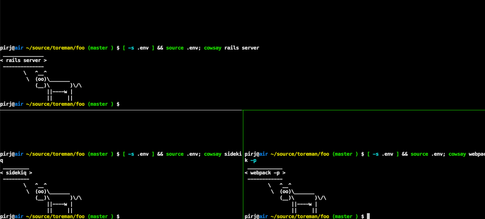
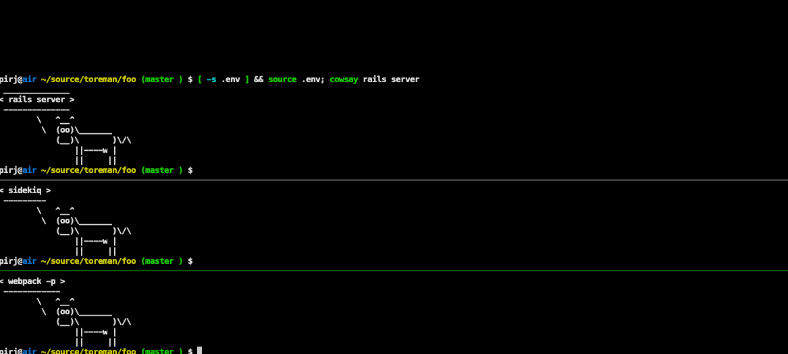

= Toreman

Toreman is a one'ish-line shell script https://github.com/ddollar/foreman[foreman] clone that is running processes in separate https://github.com/tmux/tmux[tmux] panes.

With tmux, interleaved output, and interactive debugging are not a problem anymore.

It's also possible to selectively stop/restart processes.

== Usage

In a running tmux session, from a directory containing `Procfile`, run `toreman`.
It will parse your `Procfile` and run each entry in a separate split.

Use C-b h/j to navigate between panes, and C-b z to toggle full-screen zoom.

It's possible to specify a layout as a first argument to `toreman`, e.g.

[source,shell]
----
toreman even-vertical
----

Available layouts are: `even-horizontal`, `even-vertical`, `main-horizontal`, `main-vertical`, `tiled` (default).

== Installation

If you're on macOS and are using https://brew.sh/[Homebrew], it's as easy as:

[source,shell]
----
brew install pirj/homebrew-toreman/toreman
----

Otherwise, drop the `toreman` binary somewhere on your `$PATH`, or add an alias in your `rc` file:

[source,shell]
----
alias toreman="grep --invert-match '#' < Procfile | sed -e 's/^[^:]*: //' | xargs -I {} tmux split-window -v \; send-keys '[ -s .env ] && source .env; {}' 'C-m' && tmux select-pane -t 1 \; send-keys 'C-d' \; select-layout ${1:-tiled}"
----

== Alternatives

Check out https://github.com/DarthSim/overmind[overmind] if you prefer 1600 lines of Go over one line of shell script, or other https://github.com/ddollar/foreman#ports[Foreman ports].

== Resources

https://fili.pp.ru/oneline-procfile-manager.html[Blog post].

https://www.reddit.com/r/ruby/comments/bpka4m/toreman_a_oneline_foreman_port_for_use_with_tmux/[Reddit thread].

== Author

https://fili.pp.ru[Phil Pirozhkov], software developer in law.

== License

Toreman is licensed under MIT License.
